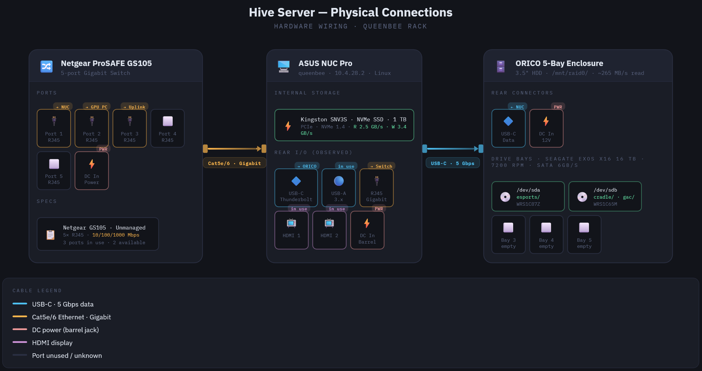

# The Hive Server — Infrastructure Overview

## The Hive Server

The server located at The Hive functions as the central data storage and processing hub for the Play-Smart project. It is responsible for receiving, storing, and organizing data collected during player sessions conducted on the PCs within The Hive. Upon completion of a session, data is automatically transferred from the collection PCs to the server, where it is processed and made available through the platform's dashboard.

In addition to regular session data, data is also collected from external events - such as Dutch Comic Con - where event-specific data is stored separately to maintain a clear distinction between standard sessions and off-site recordings.

---

## Requirements

### Server-side

| Requirement | Details |
|---|---|
| Network access | Must be on the BUas internal network or the Hive wifi to reach `10.4.28.2` |
| SSH client | Any standard terminal (e.g. cmd, PowerShell) |
| Credentials | Transfer document containing the `kowalski` SSH password |
| Storage | ORICO enclosure powered on before starting containers |

### Windows (data collection PCs)

| Requirement | Details |
|---|---|
| Python | Python 3.10+ with Poetry for environment management |
| Tobii SDK | Tobii Pro SDK installed and eye tracker connected via USB |
| OpenFace 2.2.0 | Compiled and accessible at the configured `BASE_DIR` path |
| SFTP access | Network connectivity to `10.4.28.2` port 22; valid SFTP credentials from transfer document |
| `main.bat` | Launcher script present and configured for the local machine paths |

---

## Server Hardware



The Play-Smart server (queenbee, 10.4.28.2) runs on an ASUS NUC Pro mini PC connected to a Netgear ProSAFE GS105 5-port Gigabit switch and an ORICO 5-bay 3.5" HDD enclosure for bulk storage.

The GS105 is an unmanaged Gigabit switch (10/100/1000 Mbps) handling local traffic between queenbee, the GPU inference PC, and the broader network uplink. Three of its five RJ45 ports are currently in use.

The NUC Pro serves as the primary host running Linux and the full Docker Compose stack. Its internal storage is a Kingston SNV3S 1 TB NVMe SSD (PCIe, NVMe 1.4), providing fast OS and application I/O.

The enclosure connects to the NUC Pro via USB-C (5 Gbps) and is mounted at `/mnt/raid0/`. It holds two Seagate Exos X16 16 TB drives (7200 rpm, SATA 6 Gb/s), with three bays remaining empty for future expansion.

---

## Server Access

| Property | Value                |
|----------|----------------------|
| OS       | Ubuntu Linux         |
| Host     | `10.4.28.2`          |
| SSH user | `kowalski`           |
| Password | In transfer document |

```bash
ssh kowalski@10.4.28.2
```

---

## Server Maintenance

Server updates can be performed at any time without impacting the running services — containers are self-contained and will continue operating normally during a host OS update.

At the start of each semester, the new intern should check for available updates and apply them if needed.

```bash
# Check for available updates
sudo apt update
 
# Review what will be upgraded (optional)
sudo apt list --upgradable
 
# Apply updates
sudo apt upgrade -y
 
# Apply major/system-level upgrades (if needed)
sudo apt full-upgrade -y
 
# Remove unused packages
sudo apt autoremove -y
```

> After a kernel update, a server reboot may be required. If so, coordinate with the team first as this **will** briefly bring down all containers.

```bash
# Check if a reboot is required
cat /var/run/reboot-required
 
# Reboot the server (only if necessary and coordinated)
sudo reboot
```

---

## Server Navigation

### Key host directories

| Path                                                                   | Description                                                                 |
|------------------------------------------------------------------------|-----------------------------------------------------------------------------|
| `/app`                                                                 | Location of the Docker Compose stack that operates the core server functions |
| `/mnt/raid0/cradle/Play-O-Meter-Y3AB-cradle-2025-2026/infrastructure/` | Play-Smart (cradle) infrastructure                                          |

### Navigating to common locations

```bash
# Go to the main Docker Compose project
cd /app
 
# Browse incoming SFTP data
cd /mnt/raid0/esports/sftp_data
 
# Browse processed data
cd /mnt/raid0/esports/sftp_data/merged
```

### Data volume mount map

| Path                                    | Description                      |
|-----------------------------------------|----------------------------------|
| `/mnt/raid0/esports/sftp_data/`         | Incoming SFTP uploads (raw data) |
| `/mnt/raid0/esports/sftp_data/gaze/`    | Processed gaze data              |
| `/mnt/raid0/esports/sftp_data/merged/`  | Merged session data              |
| `/mnt/raid0/esports/sftp_data/input/`   | Input data                       |
| `/mnt/raid0/esports/sftp_data/emotion/` | OpenFace emotion data            |
| `/mnt/raid0/esports/sftp_data/video/`   | Video recordings                 |
| `/mnt/raid0/esports/sftp_data/eda/`     | Nuanic ring data                 |

> These are **host-level mounts** — data is accessible directly on the server regardless of whether containers are running.

---

## Working with Containers

### Active stack containers

| Container image                   | Container name       | Description                                                                                                              |
|-----------------------------------|----------------------|--------------------------------------------------------------------------------------------------------------------------|
| `220755842/bg-app-frontend`       | `app-frontend`       | Serves the React/Nginx frontend application for the Play-Smart dashboard.                                                |
| `220755842/bg-app-backend`        | `app-backend`        | Hosts the FastAPI backend, exposing REST endpoints for the dashboard and data access layer.                              |
| `220755842/bg-app-pipeline`       | `app-pipeline`       | Executes the data processing pipeline, including multi-source data merging and automated data quality report generation. |
| `220755842/bg-app-inference`      | `app-inference`      | Runs the model inference scripts on the Hive workstations, handling prediction requests against the deployed ML models.  |
| `atmoz/sftp`                      | `app-sftp-container` | Provides a secure SFTP endpoint for transferring session data from the Hive workstations to the server.                  |

> All containers above should be running at all times and are configured to restart automatically after a reboot. The only exception is `app-pipeline` — this container is not persistent and is instead triggered by cron jobs to ensure new data is always processed.

### Container commands

```bash
# List all running containers
docker ps
 
# List all containers (including stopped)
docker ps -a

# List all containers in an easy to read format (including stopped)
docker ps -a --format "table {{.Names}}\t{{.Image}}\t{{.Status}}\t{{.Ports}}"
 
# Open a shell inside a running container
docker exec -it <container_name> bash
 
# Run a one-off command inside a container
docker exec <container_name> python auto_merge.py
 
# View live logs
docker logs <container_name>
 
# Follow logs in real time
docker logs -f <container_name>
 
# View last N lines of logs
docker logs --tail 100 <container_name>
```

### Managing the stack

```bash
# Start the full stack (detached)
docker compose up -d
 
# Start and rebuild images
docker compose up -d --build
 
# Stop the full stack
docker compose down
 
# Stop and remove volumes (destructive!)
docker compose down -v
 
# Pull latest images from Docker Hub
docker compose pull
 
# Restart a single service
docker compose restart <service_name>
 
# View status of all services
docker compose ps
```

---

## Data Pipeline Scripts

Scheduled via **cron** inside pipeline containers:

| Script                    | Purpose                                  |
|---------------------------|------------------------------------------|
| `auto_merge.py`           | Merges incoming raw data files           |
| `auto_cleaning_and_dq.py` | Cleans data and runs data quality checks |
| `auto_dq_report.py`       | Generates data quality reports           |

The active cron jobs on the server can be viewed by running:

```bash
crontab -l          # see all running cron jobs
systemctl status cron   # check if a cron job triggered something
crontab -e          # edit cron jobs
```

The configured schedule:

```bash
# Every 5 minutes: merge any newly uploaded session data
*/5 * * * * cd /home/kowalski/app && docker compose run --rm app-pipeline python auto_merge.py >> /home/kowalski/logs/auto_merge.log 2>&1

# Every day at 02:00: run data cleaning and quality checks
0 2 * * * cd /home/kowalski/app && docker compose run --rm app-pipeline python auto_cleaning_and_dq.py

# Every day at 02:15: generate the data quality report
15 2 * * * cd /home/kowalski/app && docker compose run --rm app-pipeline python auto_dq_report.py
```

### Inspecting the pipeline code

Inspecting the code inside the `app-pipeline` container requires a few extra steps, as this container is rarely active. Spin up a temporary container using the same image:

```bash
# Create a temporary interactive container using the app-pipeline image
docker run -it --name pipeline_inspect 220755842/bg-app-pipeline bash
```

The `-it` flag starts an interactive shell session, and the `bash` argument overrides the container's default entrypoint — allowing you to browse and inspect the code inside. Once done, clean up the temporary container:

```bash
exit                            # Exit the shell
docker rm pipeline_inspect      # Remove the temporary container
```

---

## Useful Commands

Inspecting the filesystem from the host (no container needed):

```bash
# List files in a data directory
ls -lh /mnt/raid0/esports/sftp_data/gaze
 
# Check disk usage per subdirectory
du -sh /mnt/raid0/esports/data/*/
 
# Count files in a directory
find /mnt/raid0/esports/sftp_data -type f | wc -l
 
# Check file types present
find /mnt/raid0/esports/data -type f | sed 's/.*\.//' | sort | uniq -c | sort -rn
 
# Search for code referencing a specific path
grep -r "sftp_data" /mnt/raid0/esports/server/python_app --include="*.py" -l

# Download files or folders from the server to a local PC (run in a local terminal, not on the server)
scp -r kowalski@10.4.28.2:app/docker-compose.yml Documents
scp -r kowalski@10.4.28.2:app/ Documents
```

---

## Project: Dash-board app (B.G.E.T.)

The server hosts the **Breda Guardians Esports Tool (B.G.E.T.)**, the backend infrastructure for the **Play-Smart** esports analytics platform. It collects and processes multimodal and biometric data from esports players and presents it through a web dashboard.

---

## Deployed Stack (Docker Compose)

| Service                  | Description                                       | Docker Hub Image            |
|--------------------------|---------------------------------------------------|-----------------------------|
| **FastAPI backend**      | REST API serving player analytics data            | `220755842/bg-app-backend`  |
| **Vite/React frontend**  | Web dashboard UI                                  | `220755842/bg-app-frontend` |
| **Nginx**                | Reverse proxy in front of frontend/backend        | —                           |
| **PostgreSQL / bget.db** | Persistent database volume                        | —                           |
| **SFTP container**       | Receives uploaded data files from player machines | `atmoz/sftp`                |
| **Pipeline containers**  | Python data processing scripts                    | `220755842/bg-app-pipeline` |
| **cron-scheduled**       | Cron jobs for triggering pipeline code            | —                           |

### Frontend build note

The frontend requires a build argument at image build time:

```bash
--build-arg VITE_BACKEND_URL=<backend_url>
```

<!-- ---

## Data Collection (Windows-side)

Player biometric data is collected locally on **Windows machines** using a toolkit launcher:

- `main.bat` — entry point launcher
- **Pygame visualization** — real-time feedback during sessions
- **Tobii eye tracker integration** — gaze & fixation data
- **Keyboard/mouse input logging**
- **OpenFace emotion recognition** — facial action unit data

Collected data is pushed to the server via the SFTP container and processed through the pipeline into the dashboard. -->

---

## Legacy Containers (Non-Active)

The following containers exist on the server but are not part of the active Play-Smart stack. They are remnants of earlier development phases or the Play-O-Meter predecessor project.

| Container image                             | Container name                   | Description                                                                                                                           |
|---------------------------------------------|----------------------------------|---------------------------------------------------------------------------------------------------------------------------------------|
| `server-python-app`                         | `focused_brown`                  | Python application container; exits via wait-for-it script, likely waiting on a dependency that never came up.                       |
| `server_remote_sftp`                        | `affectionate_mayer`             | SFTP server instance. Likely a duplicate or staging remnant.                                                                          |
| `server_remote_postgres`                    | `admiring_goodall`               | PostgreSQL instance that failed to start. Not in use.                                                                                 |
| `server_remote_sftp`                        | `lucid_cerf`                     | SFTP server with no recent activity. Likely an unused duplicate.                                                                      |
| `python:3.10-slim`                          | `analytics-backend`              | Bare Python 3.10 slim image. No dedicated image — likely a one-off or legacy development container.                                   |
| `cradle-playometer-data-orchestration`      | `data-orchestration`             | Play-O-Meter data orchestration container. Contains scripts for MKV-to-MP4 conversion and OpenFace processing. Needs further review.  |
| `cradle-playometer-monitoring`              | `monitoring`                     | Plotly Dash monitoring dashboard for Play-O-Meter. Accessible at `http://0.0.0.0:8050` when running.                                  |
| `adminer`                                   | `adminer`                        | Web-based database management UI. Exposed on port `8090` → `8080`.                                                                    |
| `timescale/timescaledb:latest-pg14`         | `vhesper-timescaledb`            | TimescaleDB (PostgreSQL 14) time-series database. Exposed on port `5454`. Likely the primary data store for Play-O-Meter metrics.     |
| `research-website`                          | `research-website`               | Nginx-served static website documenting the research toolkit. Accessible at `http://10.4.28.2` when running.                         |
| `server_remote_postgres`                    | `staging_production_postgres_db` | PostgreSQL instance with logs showing prior active use. Likely a staging/production database for an older pipeline version.           |
| `server_remote_sftp`                        | `sftp_server`                    | SFTP server previously used for data transfers. Logs show it was actively used before being stopped.                                  |

<!-- --- -->

<!-- ## Known Issues Resolved

- Dockerfile build-arg ordering for `VITE_BACKEND_URL`
- `bget.db` volume mount misconfiguration
- Nested Git repository issues in the codebase
- Poetry environment setup for pipeline scripts -->

---

## TODO

- [ ] **Audit legacy containers** — Confirm which of the non-active containers can be permanently removed from the server. Candidates: `focused_brown`, `affectionate_mayer`, `admiring_goodall`, `lucid_cerf`, `analytics-backend`, `sftp_server`, `staging_production_postgres_db`.
- [ ] **Investigate `data-orchestration`** — Clarify the full responsibilities of the `cradle-playometer-data-orchestration` container (MKV-to-MP4 conversion, OpenFace processing). Determine if any of this functionality needs to be ported into the active stack or can be decommissioned.
- [ ] **Decide fate of Play-O-Meter monitoring stack** — `monitoring` (Plotly Dash) and `vhesper-timescaledb` are running but belong to the predecessor project. Confirm whether these are still needed or can be shut down.
- [ ] **Clean up duplicate SFTP containers** — Multiple `server_remote_sftp` instances exist (`affectionate_mayer`, `lucid_cerf`, `sftp_server`). Consolidate or remove.
- [ ] **Fix `admiring_goodall` PostgreSQL startup error** — Investigate and either fix or decommission.
- [ ] **Document `adminer` access** — Clarify who should have access to the Adminer UI on port `8090` and whether it should be restricted.
- [ ] **Verify cron job logging** — The `auto_cleaning_and_dq.py` and `auto_dq_report.py` cron jobs do not have log redirection (`>> logfile 2>&1`). Add logging for easier debugging.
- [ ] **Add monitoring/alerting** — No uptime monitoring is currently in place for the active container stack. Consider adding a lightweight health-check or alert for when containers go down unexpectedly.