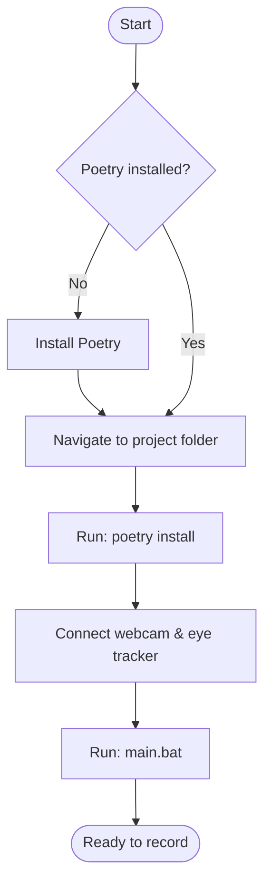

# Toolkit Setup Guide

## Prerequisites 2

Before getting started, make sure you have the following installed and available:

- [Python](https://www.python.org/downloads/) (3.8 or higher)
- [Poetry](https://python-poetry.org/docs/#installation) (dependency manager)
- A connected **webcam**
- A connected **eye tracker** (e.g. Tobii)

---

## Setup Flow



---

## Step 1 — Set Up the Poetry Environment

1. Verify that Poetry is installed:
   ```bash
   poetry --version
   ```

2. Navigate to the project folder containing `pyproject.toml` and `poetry.lock`:
   ```bash
   cd path/to/project
   ```

3. Install the project dependencies:
   ```bash
   poetry install
   ```
   This creates a `.venv` folder inside the project directory.

> [!NOTE]
> The `.venv` folder must exist before `main.bat` can be run successfully.

---

## Step 2 — Start the Toolkit

1. Make sure your **webcam** and **eye tracker** are connected.
2. Launch the toolkit:
   ```bash
   main.bat
   ```
   Or double-click `main.bat` in File Explorer.

---

## Controls

| Key | Action |
|-----|--------|
| `F7` | Start recording |
| `F12` | Stop recording |

---

## Troubleshooting

> [!TIP]
> Always make sure your devices are connected *before* launching the toolkit.

> [!WARNING]
> If `poetry install` fails, confirm you are in the correct folder — it must contain `pyproject.toml`.

> [!NOTE]
> If Poetry is not found after installation, restart your terminal and verify that Poetry is added to your system `PATH`.

---

## Project Structure

```
project/
├── main.bat            # Entry point to launch the toolkit
├── pyproject.toml      # Poetry project configuration
├── poetry.lock         # Locked dependency versions
└── .venv/              # Virtual environment (auto-generated)
```